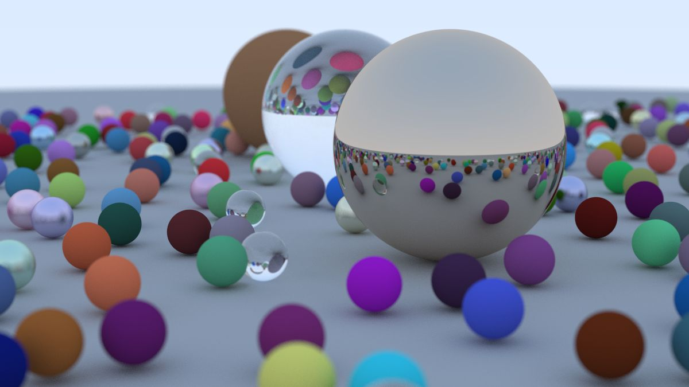
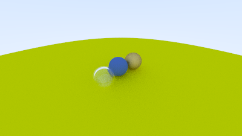

# RayTracing_cpp_cpu

#Ray Tracer( Ray Tracing in one weekend )
A simple CPU Based ray tracer implemented in **c++** , following the book 
**_Ray Tracing in One Weekend_ by Peter shirley**

This Project was built to understand the fundamentals of 
-Ray-Object Intersection
-Diffuse and Metallic materials
-Dielectrics(glass)
-Camera Physics  ( 'lookfrom' , FOV , aspect ratio)
-Recursive Ray scattering and color accumulation

---

## RENDERS

**Final Render*
This image demonstrates the complete rendering pipeline with , diffuse , metal and dielectric materials along with multiple sample per pixel.



---

**Diffuse / Camera ( LOOKFROM) stage*
tis was generated during the camera setup and diffuse material stage ,
showing how camera position ("lookfrom") and ray scattering affect the scene.



---

## Features

- Vector Math ( 'vec3')
-Ray Class and Hit Record
-Sphere Primitives
-Lambertian(diffuse) materials
-metal materials with fuzziness
-fOV
-gamma correction
....
....

---

## BUILD and RUN

compile using any modernC++ compiler 

```bash
g++ -std=c++17 main.cpp -O2 -o raytracer
./raytracer > image.ppm

---

## Refrences
Peter shirley , Ray trcing in one weekend 
https://raytracing.github.io/

## Author
Mecha Rahul
Eng. Student
